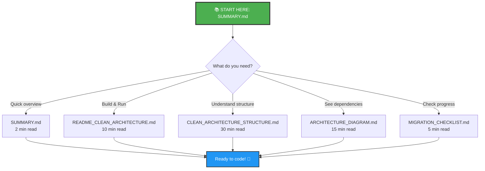

# 📚 DOCUMENTATION INDEX

## 🎯 Quick Links

Chọn file phù hợp với nhu cầu của bạn:

| # | File | Mục đích | Đọc khi... |
|---|------|----------|-----------|
| 1️⃣ | **[SUMMARY.md](./SUMMARY.md)** | Tóm tắt nhanh | Bạn muốn hiểu tổng quan trong 2 phút |
| 2️⃣ | **[README_CLEAN_ARCHITECTURE.md](./README_CLEAN_ARCHITECTURE.md)** | Hướng dẫn đầy đủ | Bạn cần build & run project |
| 3️⃣ | **[CLEAN_ARCHITECTURE_STRUCTURE.md](./CLEAN_ARCHITECTURE_STRUCTURE.md)** | Chi tiết cấu trúc | Bạn muốn hiểu từng folder/file |
| 4️⃣ | **[ARCHITECTURE_DIAGRAM.md](./ARCHITECTURE_DIAGRAM.md)** | Dependency flow | Bạn muốn hiểu dependencies & communication |
| 5️⃣ | **[MIGRATION_CHECKLIST.md](./MIGRATION_CHECKLIST.md)** | Checklist tasks | Bạn muốn xem đã làm gì, còn gì phải làm |

---

## 📖 Reading Guide

### 🚀 Nếu bạn là Developer mới join project:

1. Đọc **SUMMARY.md** (2 phút) - Hiểu tổng quan
2. Đọc **README_CLEAN_ARCHITECTURE.md** (10 phút) - Học cách build & run
3. Đọc **ARCHITECTURE_DIAGRAM.md** (15 phút) - Hiểu dependencies
4. Đọc **CLEAN_ARCHITECTURE_STRUCTURE.md** (30 phút) - Hiểu chi tiết cấu trúc

### 🔧 Nếu bạn cần build project:

1. **README_CLEAN_ARCHITECTURE.md** → Section "Cách Build & Run"
2. Chạy commands:
   ```powershell
   dotnet restore
   dotnet build
   ```

### 🏗️ Nếu bạn cần hiểu Clean Architecture:

1. **ARCHITECTURE_DIAGRAM.md** → Xem dependency flow
2. **CLEAN_ARCHITECTURE_STRUCTURE.md** → Xem chi tiết từng layer

### ✅ Nếu bạn cần biết project đã setup gì:

1. **MIGRATION_CHECKLIST.md** → Xem các tasks đã hoàn thành

---

## 📂 Project Structure Overview

```
BHK_Retrieval_Attendance.Project/
│
├── 📁 BHK.Retrieval.Attendance.WPF/              ⭐ Main WPF App (Startup)
├── 📁 BHK.Retrieval.Attendance.Core/             Business Logic
├── 📁 BHK.Retrieval.Attendance.Infrastructure/   Data & External Services
├── 📁 BHK.Retrieval.Attendance.Shared/           Common Utilities
│
├── 📄 BHK_Retrieval_Attendance.Project.sln       Solution File
│
└── 📚 Documentation/
    ├── SUMMARY.md                                ← Bạn đang ở đây
    ├── README_CLEAN_ARCHITECTURE.md              Build & Run guide
    ├── CLEAN_ARCHITECTURE_STRUCTURE.md           Detailed structure
    ├── ARCHITECTURE_DIAGRAM.md                   Dependency diagrams
    └── MIGRATION_CHECKLIST.md                    Task checklist
```

---

## 🎯 Quick Start

```powershell
# 1. Navigate to project
cd "k:\Workspace\BHK workspace\BHK_Retrieval_Attendance\BHK_Retrieval_Attendance.Project"

# 2. Restore packages
dotnet restore

# 3. Build solution
dotnet build

# 4. Run application
dotnet run --project BHK.Retrieval.Attendance.WPF\BHK.Retrieval.Attendance.WPF.csproj
```

---

## 📊 Documentation Map



---

## 🔑 Key Concepts

### Clean Architecture Layers

1. **Presentation (WPF)** - UI & User Interaction
2. **Core (Business Logic)** - Domain & Use Cases
3. **Infrastructure** - Data & External Services
4. **Shared** - Common Utilities

### Dependencies Flow

```
WPF → Infrastructure → Core → Shared
(Outer layers depend on inner layers only)
```

---

## ✅ Status

| Component | Status |
|-----------|--------|
| Project Structure | ✅ Complete |
| .csproj Files | ✅ Complete |
| Dependencies | ✅ Configured |
| Build | ✅ Success |
| Documentation | ✅ Complete |

---

## 📞 Need Help?

1. **Build issues?** → Read `README_CLEAN_ARCHITECTURE.md`
2. **Don't understand structure?** → Read `CLEAN_ARCHITECTURE_STRUCTURE.md`
3. **Confused about dependencies?** → Read `ARCHITECTURE_DIAGRAM.md`
4. **Want quick overview?** → Read `SUMMARY.md`

---

**Last Updated:** October 8, 2025  
**Main Startup Project:** BHK.Retrieval.Attendance.WPF
