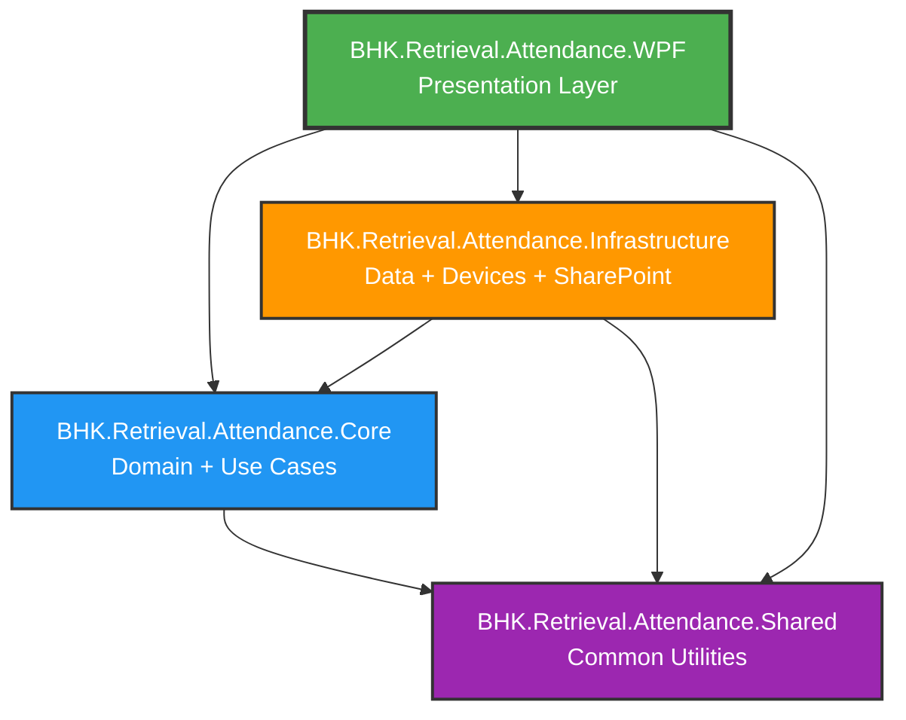

# ✅ CẬP NHẬT CẤU TRÚC CLEAN ARCHITECTURE - HOÀN TẤT

## 🎯 Tổng Kết Các Thay Đổi

### ✅ Đã Hoàn Thành

1. **✔ Di chuyển folder BHK.Retrieval.Attendance.WPF**
   - Từ: `BHK_Retrieval_Attendance\BHK.Retrieval.Attendance.WPF\`
   - Đến: `BHK_Retrieval_Attendance.Project\BHK.Retrieval.Attendance.WPF\`

2. **✔ Tạo các .csproj files theo Clean Architecture**
   - ✅ `BHK.Retrieval.Attendance.WPF.csproj` - Main WPF (Presentation Layer)
   - ✅ `BHK.Retrieval.Attendance.Core.csproj` - Domain + Use Cases
   - ✅ `BHK.Retrieval.Attendance.Infrastructure.csproj` - Data, Devices, SharePoint
   - ✅ `BHK.Retrieval.Attendance.Shared.csproj` - Common Utilities

3. **✔ Cấu hình Dependencies đúng Clean Architecture**
   ```
   WPF → Core + Infrastructure + Shared
   Infrastructure → Core + Shared
   Core → Shared
   Shared → (no dependencies)
   ```

4. **✔ Cập nhật Solution file** với 4 projects mới

5. **✔ Backup file cũ** → `BHK_Retrieval_Attendance.Project.csproj.OLD`

6. **✔ Build thành công** tất cả 4 projects

---

## 📁 Cấu Trúc Mới (Clean Architecture)

```
BHK_Retrieval_Attendance.Project/
│
├── 📄 BHK_Retrieval_Attendance.Project.sln  ← Solution File
├── 📄 CLEAN_ARCHITECTURE_STRUCTURE.md       ← Hướng dẫn chi tiết
│
├── 📁 BHK.Retrieval.Attendance.WPF/         ← ⭐ MAIN STARTUP PROJECT
│   ├── ViewModels/
│   ├── Views/
│   ├── Models/
│   ├── Services/
│   ├── Commands/
│   ├── Converters/
│   ├── Behaviors/
│   ├── Resources/
│   ├── Configuration/
│   ├── Utilities/
│   ├── App.xaml
│   ├── App.xaml.cs
│   └── BHK.Retrieval.Attendance.WPF.csproj  ← Main Project File
│
├── 📁 BHK.Retrieval.Attendance.Core/
│   ├── Domain/         (Entities, Value Objects)
│   ├── UseCases/       (Business Logic)
│   ├── Interfaces/     (Contracts)
│   ├── Contracts/      (DTOs)
│   └── BHK.Retrieval.Attendance.Core.csproj
│
├── 📁 BHK.Retrieval.Attendance.Infrastructure/
│   ├── Devices/        (Realand, ZKTeco)
│   ├── SharePoint/     (PnP Integration)
│   ├── Persistence/    (EF Core, Repositories)
│   ├── FileStorage/    (Export/Import)
│   ├── External/       (Email, SMS, AD)
│   └── BHK.Retrieval.Attendance.Infrastructure.csproj
│
└── 📁 BHK.Retrieval.Attendance.Shared/
    ├── Extensions/
    ├── Results/
    ├── Options/
    ├── Constants/
    ├── Exceptions/
    ├── Utilities/
    └── BHK.Retrieval.Attendance.Shared.csproj
```

---

## 🚀 Cách Build & Run

### Build toàn bộ Solution
```powershell
cd "k:\Workspace\BHK workspace\BHK_Retrieval_Attendance\BHK_Retrieval_Attendance.Project"
dotnet restore
dotnet build
```

### Run Main Application
```powershell
dotnet run --project BHK.Retrieval.Attendance.WPF\BHK.Retrieval.Attendance.WPF.csproj
```

### Build theo thứ tự dependencies
```powershell
dotnet build BHK.Retrieval.Attendance.Shared\BHK.Retrieval.Attendance.Shared.csproj
dotnet build BHK.Retrieval.Attendance.Core\BHK.Retrieval.Attendance.Core.csproj
dotnet build BHK.Retrieval.Attendance.Infrastructure\BHK.Retrieval.Attendance.Infrastructure.csproj
dotnet build BHK.Retrieval.Attendance.WPF\BHK.Retrieval.Attendance.WPF.csproj
```

---

## 🔗 Project Dependencies Graph



---

## 📦 NuGet Packages theo Layer

### 🎨 WPF Layer
- CommunityToolkit.Mvvm
- MaterialDesignThemes
- Microsoft.Extensions.DependencyInjection
- Microsoft.Extensions.Hosting
- Serilog
- AutoMapper
- FluentValidation

### 🧠 Core Layer
- FluentValidation
- MediatR

### 🔧 Infrastructure Layer
- EntityFrameworkCore
- PnP.Framework (SharePoint)
- EPPlus (Excel Export)
- iTextSharp (PDF Export)
- MailKit (Email)

### 🛠️ Shared Layer
- Microsoft.Extensions.Logging.Abstractions
- Microsoft.Extensions.Configuration.Abstractions

---

## ⚠️ Lưu Ý Quan Trọng

### 🎯 Main Startup Project
**Main Project:** `BHK.Retrieval.Attendance.WPF`

Trong Visual Studio:
1. Right-click vào `BHK.Retrieval.Attendance.WPF`
2. Chọn **"Set as Startup Project"**

### 🗂️ Files Cần Xử Lý

#### ✅ Đã Backup
- `BHK_Retrieval_Attendance.Project.csproj.OLD` (file .csproj cũ)

#### ⚠️ Cần Di Chuyển Code (nếu có)
Nếu có code trong các folder sau ở root project, hãy di chuyển vào project tương ứng:

```
Root folders (cần di chuyển):           → Target projects:
├── Core/                               → BHK.Retrieval.Attendance.Core/
├── Infrastructure/                     → BHK.Retrieval.Attendance.Infrastructure/
├── Shared/                             → BHK.Retrieval.Attendance.Shared/
├── WPF/                                → BHK.Retrieval.Attendance.WPF/
├── ViewModels/                         → BHK.Retrieval.Attendance.WPF/ViewModels/
├── Views/                              → BHK.Retrieval.Attendance.WPF/Views/
├── Models/                             → BHK.Retrieval.Attendance.WPF/Models/
└── ... (các folder WPF khác)           → BHK.Retrieval.Attendance.WPF/...
```

#### 🗑️ Có thể Xóa (sau khi di chuyển)
- Các folder trùng lặp ở root sau khi đã di chuyển code
- File `.csproj.OLD` sau khi xác nhận build thành công

---

## ✅ Build Status

**Build Result:** ✅ **SUCCESS**

```
✔ BHK.Retrieval.Attendance.Shared       → Compiled
✔ BHK.Retrieval.Attendance.Core         → Compiled
✔ BHK.Retrieval.Attendance.Infrastructure → Compiled
✔ BHK.Retrieval.Attendance.WPF          → Compiled

Build Time: ~11s
Warnings: 22 (nullable warnings + legacy package warnings - không ảnh hưởng)
Errors: 0
```

---

## 📝 Next Steps

1. **✅ HOÀN THÀNH** - Cấu trúc Clean Architecture đã được thiết lập

2. **Tùy chọn** - Di chuyển code từ folders cũ:
   ```powershell
   # Nếu có code trong các folder cũ, di chuyển vào projects tương ứng
   ```

3. **Tùy chọn** - Xóa folders trùng lặp:
   ```powershell
   # Sau khi di chuyển xong, xóa các folder cũ
   ```

4. **Test ứng dụng:**
   ```powershell
   dotnet run --project BHK.Retrieval.Attendance.WPF\BHK.Retrieval.Attendance.WPF.csproj
   ```

---

## 📚 Tài Liệu Tham Khảo

- 📄 `CLEAN_ARCHITECTURE_STRUCTURE.md` - Hướng dẫn chi tiết cấu trúc
- 📄 `README.md` (file này) - Tổng quan dự án

---

## 🎉 Kết Luận

✅ **Cấu trúc Clean Architecture đã được thiết lập thành công!**

- ✔ Dependencies đúng theo nguyên tắc Clean Architecture
- ✔ Tất cả 4 projects build thành công
- ✔ Sẵn sàng để phát triển tiếp

**Main Startup Project:** `BHK.Retrieval.Attendance.WPF`
