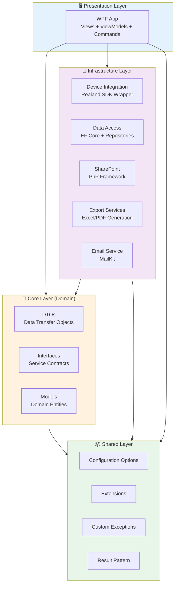
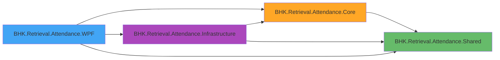
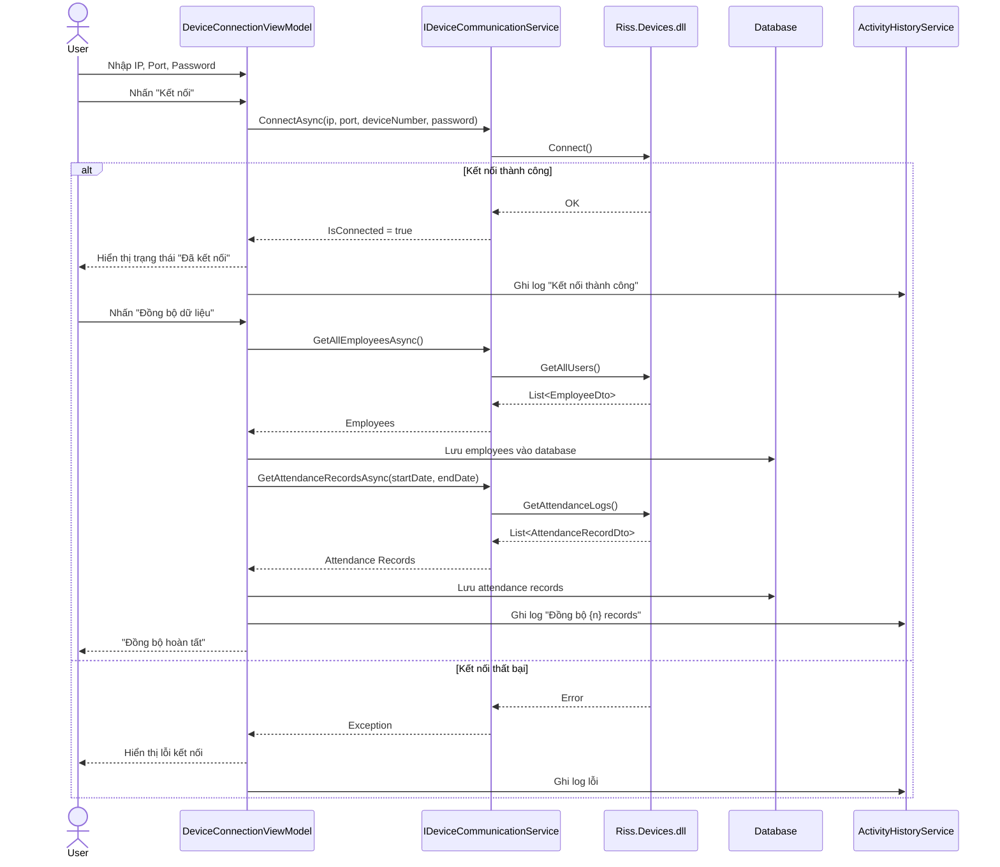
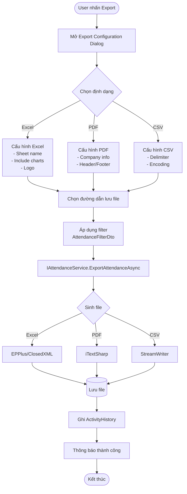

# Hệ thống Quản lý Chấm công BHK

**Technical Documentation**
- Sinh từ phân tích codebase
- Ngày tạo: 26/02/2026
- Trạng thái: Internal Draft

---
PAGE BREAK
---

## Mục lục

1. [Tổng quan hệ thống](#1-tổng-quan-hệ-thống)
2. [Kiến trúc tổng thể](#2-kiến-trúc-tổng-thể)
3. [Cấu trúc dự án](#3-cấu-trúc-dự-án)
4. [Module chức năng](#4-module-chức-năng)
5. [Luồng xử lý chính](#5-luồng-xử-lý-chính)
6. [Tầng dữ liệu và mô hình dữ liệu](#6-tầng-dữ-liệu-và-mô-hình-dữ-liệu)
7. [Tích hợp bên ngoài](#7-tích-hợp-bên-ngoài)
8. [Rủi ro và điểm yếu](#8-rủi-ro-và-điểm-yếu)
9. [Hướng dẫn bảo trì](#9-hướng-dẫn-bảo-trì)
10. [Phụ lục](#10-phụ-lục)

---
PAGE BREAK
---

## Lịch sử thay đổi kỹ thuật

| Document Version | System Version | Người thực hiện | Ngày hoàn thành | Loại thay đổi | Ghi chú |
|------------------|---------------|-----------------|-----------------|--------------|--------|
| 1.0 | 1.0.0 | AI Audit | 26/02/2026 | Initial | Sinh từ codebase |

---
PAGE BREAK
---

## Thông tin hệ thống

| Thành phần | Phiên bản / Thông tin | Nguồn |
|------------|----------------------|------|
| Phiên bản hệ thống | 1.0.0 | appsettings.json -> ApplicationSettings |
| Tình trạng | Development/Production | Environment-based (appsettings.{env}.json) |
| Kiểu ứng dụng | Desktop (WPF) | BHK.Retrieval.Attendance.WPF.csproj |
| .NET Ecosystem | .NET 8.0 (net8.0, net8.0-windows) | *.csproj -> TargetFramework |
| Kiến trúc | Clean Architecture + MVVM | Solution structure |
| UI Framework | WPF + Material Design (v4.9.0) | WPF.csproj -> MaterialDesignThemes |
| Data Persistence | EF Core 8.0 + SQL Server, SQLite | Infrastructure.csproj |
| CQRS Pattern | MediatR 12.2.0 | Core.csproj |
| Thiết bị chấm công | Realand SDK (Riss.Devices.dll) | packages/Riss.Devices/ |
| SharePoint Integration | PnP.Framework 1.12.0 | Infrastructure.csproj |
| Export Engine | EPPlus 7.0.0, ClosedXML 0.102.1, iTextSharp 5.5.13.3 | Infrastructure.csproj |
| Email | MailKit 4.3.0 | Infrastructure.csproj |
| Logging | Serilog 4.3.1 + File sink | appsettings.json -> Serilog |

---
PAGE BREAK
---

## 1. Tổng quan hệ thống

### 1.1 Mô tả hệ thống

**BHK Retrieval Attendance System** là hệ thống quản lý chấm công desktop chạy trên nền tảng Windows, được xây dựng bằng .NET 8.0 WPF. Hệ thống tích hợp với thiết bị chấm công vân tay Realand/ZKTeco để:

- Thu thập và đồng bộ dữ liệu chấm công từ thiết bị phần cứng
- Quản lý thông tin nhân viên và enrollment (vân tay, thẻ, mật khẩu)
- Tạo báo cáo và xuất dữ liệu (Excel, PDF, CSV)
- Tích hợp với SharePoint Online (tùy chọn)
- Gửi báo cáo tự động qua email

### 1.2 Mục tiêu thiết kế

- **Phân tách trách nhiệm rõ ràng**: Áp dụng Clean Architecture để tách biệt business logic khỏi UI và infrastructure
- **Dễ bảo trì**: Mỗi layer có trách nhiệm riêng, dependencies rõ ràng (Core → Shared; Infrastructure → Core + Shared)
- **Dễ mở rộng**: Hỗ trợ thêm thiết bị, định dạng export, hoặc tích hợp mới thông qua interface
- **Trải nghiệm người dùng**: Sử dụng Material Design cho giao diện hiện đại, hỗ trợ Light/Dark theme

### 1.3 Phạm vi triển khai

- **Môi trường**: Windows 10/11, .NET 8.0 Runtime
- **Người dùng**: Nhân viên HR/Admin quản lý chấm công trong nội bộ doanh nghiệp
- **Quy mô**: Single-user desktop app, kết nối LAN với thiết bị chấm công và SQL Server

---
PAGE BREAK
---

## 2. Kiến trúc tổng thể

### 2.1 Kiến trúc phân lớp (Clean Architecture)

Hệ thống được thiết kế theo **Clean Architecture** với 4 tầng chính:

**Tên hình:** Kiến trúc phân lớp Clean Architecture  
**Loại:** Mermaid  
**Nguồn:** BHK_Retrieval_Attendance.Project.sln



### 2.2 Dependencies Direction

**Nguyên tắc**: Dependencies luôn hướng vào trong (Presentation → Infrastructure → Core → Shared)

- **Shared**: Không phụ thuộc vào project nào (base utilities)
- **Core**: Chỉ phụ thuộc Shared (business logic thuần túy)
- **Infrastructure**: Phụ thuộc Core + Shared (triển khai interfaces từ Core)
- **WPF**: Phụ thuộc tất cả (composition root)

### 2.3 Pattern áp dụng

- **MVVM (Model-View-ViewModel)**: UI layer sử dụng CommunityToolkit.Mvvm
- **CQRS (Command Query Responsibility Segregation)**: MediatR 12.2.0 trong Core layer (dự kiến)
- **Repository Pattern**: Data access thông qua repositories
- **Dependency Injection**: Microsoft.Extensions.DependencyInjection
- **Options Pattern**: Configuration binding với IOptions<T>
- **Result Pattern**: Shared/Results cho error handling rõ ràng

---
PAGE BREAK
---

## 3. Cấu trúc dự án

### 3.1 Solution Structure

```
BHK_Retrieval_Attendance.Project/
│
├── BHK.Retrieval.Attendance.WPF/           # 🖥️ Presentation Layer
│   ├── Views/                               # XAML Views (Windows, Pages, Dialogs)
│   ├── ViewModels/                          # ViewModels (MVVM pattern)
│   ├── Commands/                            # RelayCommands
│   ├── Converters/                          # Value Converters
│   ├── Behaviors/                           # Attached Behaviors
│   ├── Services/                            # UI-specific services
│   ├── Configuration/DI/                    # Service registration
│   ├── Resources/                           # Images, Styles, Themes
│   └── appsettings.json                     # Configuration
│
├── BHK.Retrieval.Attendance.Core/          # 🎯 Core Layer (Business Logic)
│   ├── DTOs/                                # Data Transfer Objects
│   │   ├── Requests/                        # Input DTOs (filters, commands)
│   │   └── Responses/                       # Output DTOs (EmployeeDto, AttendanceDto)
│   ├── Interfaces/                          # Service Interfaces
│   │   └── Services/                        # IDeviceCommunicationService, IAttendanceService
│   ├── Models/                              # Domain Models (ActivityHistory)
│   ├── Enums/                               # Business Enums
│   └── UseCases/                            # Use Case handlers (CQRS + MediatR)
│
├── BHK.Retrieval.Attendance.Infrastructure/ # 🔧 Infrastructure Layer
│   ├── DeviceIntegration/                   # Thiết bị chấm công
│   │   ├── Services/                        # DeviceCommunicationService (Riss.Devices wrapper)
│   │   └── Wrappers/                        # SDK adapters
│   ├── Data/                                # Data Access
│   │   ├── Context/                         # DbContext (SQL Server, SQLite)
│   │   ├── Repositories/                    # Repository implementations
│   │   ├── Configurations/                  # EF Core entity configurations
│   │   └── Migrations/                      # DB migration scripts
│   ├── SharePoint/                          # SharePoint integration (PnP.Framework)
│   ├── Export/                              # Export services
│   │   ├── Excel/                           # EPPlus, ClosedXML
│   │   └── PDF/                             # iTextSharp
│   └── Services/                            # Infrastructure services (AttendanceService, Email, etc.)
│
└── BHK.Retrieval.Attendance.Shared/        # 📦 Shared Layer
    ├── Options/                             # Configuration options classes
    ├── Exceptions/                          # Custom exceptions
    ├── Extensions/                          # Extension methods
    ├── Results/                             # Result<T> pattern
    └── Constants/                           # Shared constants
```

### 3.2 Project Dependencies

**Tên hình:** Dependency Graph giữa các projects  
**Loại:** Mermaid  
**Nguồn:** *.csproj files -> ProjectReference



### 3.3 Key Files và Responsibilities

| File/Folder | Layer | Trách nhiệm |
|------------|-------|-------------|
| `App.xaml.cs` | WPF | Composition root, DI setup, Serilog config |
| `MainWindowViewModel.cs` | WPF | Main window orchestration |
| `DeviceConnectionViewModel.cs` | WPF | Quản lý kết nối thiết bị |
| `AttendanceManagementViewModel.cs` | WPF | Quản lý dữ liệu chấm công |
| `IDeviceCommunicationService.cs` | Core/Interfaces | Contract cho device integration |
| `IAttendanceService.cs` | Core/Interfaces | Contract cho attendance business logic |
| `appsettings.json` | WPF | Cấu hình: DB, thiết bị, SharePoint, Email, Logging |
| `DeviceIntegration/Services/` | Infrastructure | Wrapper cho Riss.Devices.dll |
| `Data/Context/` | Infrastructure | EF Core DbContext |
| `ActivityHistoryRepository.cs` | Infrastructure | SQLite-based activity logging |

---
PAGE BREAK
---

## 4. Module chức năng

### 4.1 Device Integration Module

**Mục đích**: Kết nối và đồng bộ dữ liệu từ thiết bị chấm công Realand/ZKTeco.

**Thành phần chính**:
- `IDeviceCommunicationService` (Core/Interfaces): Interface định nghĩa các phương thức kết nối, lấy dữ liệu nhân viên, attendance records
- `DeviceCommunicationService` (Infrastructure): Triển khai interface, wrapper cho Riss.Devices.dll
- `DeviceViewModel` / `DeviceConnectionViewModel` (WPF): UI cho việc kết nối và quản lý thiết bị

**Chức năng chính**:
- Kết nối/ngắt kết nối thiết bị (TCP/IP)
- Lấy danh sách nhân viên (bao gồm enrollment data: vân tay, thẻ, mật khẩu)
- Lấy attendance records theo khoảng thời gian
- Monitor real-time attendance events (nếu hỗ trợ)

**Configuration**: `appsettings.json -> DeviceSettings`

### 4.2 Attendance Management Module

**Mục đích**: Quản lý dữ liệu chấm công, xem, lọc, và phân tích.

**Thành phần chính**:
- `IAttendanceService` (Core/Interfaces): Business logic cho chấm công
- `AttendanceService` (Infrastructure/Services): Triển khai xử lý dữ liệu attendance
- `AttendanceManagementViewModel` (WPF): UI quản lý danh sách chấm công
- `AttendanceDisplayDto`, `AttendanceFilterDto` (Core/DTOs): Data transfer objects

**Chức năng chính**:
- Xem danh sách chấm công theo filter (ngày, nhân viên, phòng ban)
- Đồng bộ dữ liệu từ thiết bị vào database
- Export dữ liệu chấm công

**Data Model**: AttendanceRecord (DIN, Time, State, VerifyMode)

### 4.3 Employee Management Module

**Mục đích**: Quản lý thông tin nhân viên, enrollment data.

**Thành phần chính**:
- `EmployeeViewModel` (WPF): CRUD nhân viên
- `EmployeeDto` (Core/DTOs): Thông tin nhân viên (DIN, UserName, IDNumber, DeptId, Sex, Birthday, Privilege, Enrollments)
- `EnrollmentDto` (Core/DTOs): Thông tin đăng ký (FP0-FP9, PWD, Card)

**Chức năng chính**:
- Xem danh sách nhân viên từ thiết bị hoặc database
- Thêm/Sửa/Xóa thông tin nhân viên (Giả định có căn cứ - chưa thấy CRUD implementation)
- Quản lý enrollment (vân tay, thẻ, mật khẩu)

### 4.4 Export Module

**Mục đích**: Xuất báo cáo chấm công/nhân viên sang Excel, PDF, CSV.

**Thành phần chính**:
- `Export/Excel/`, `Export/PDF/` (Infrastructure): Export services
- `ExportConfigurationDialogViewModel`, `ExportEmployeeViewModel` (WPF): UI cấu hình export
- EPPlus 7.0.0, ClosedXML 0.102.1, iTextSharp 5.5.13.3

**Chức năng chính**:
- Export attendance records theo filter
- Export employee list
- Tùy chỉnh format, logo công ty, thông tin báo cáo

**Configuration**: `appsettings.json -> ReportSettings`

### 4.5 SharePoint Integration Module

**Mục đích**: Đồng bộ dữ liệu với SharePoint Online (tùy chọn).

**Thành phần chính**:
- `SharePoint/Services/` (Infrastructure): PnP.Framework wrapper
- `SharePointSettings` (Shared/Options)

**Trạng thái**: Tắt mặc định (`SharePointSettings.Enabled: false`)

**Chức năng dự kiến**:
- Đồng bộ attendance records lên SharePoint List
- Lấy thông tin nhân viên từ SharePoint

**Configuration**: `appsettings.json -> SharePointSettings`

### 4.6 Activity History Module

**Mục đích**: Ghi log các hoạt động của người dùng trong hệ thống.

**Thành phần chính**:
- `ActivityHistory` (Core/Models): Domain model
- `IActivityHistoryRepository`, `ActivityHistoryRepository` (Infrastructure/Data): SQLite-based storage
- `ActivityHistoryService` (Infrastructure/Services)
- `ActivityHistoryViewModel` (WPF)

**Chức năng chính**:
- Ghi log mọi hành động quan trọng (kết nối thiết bị, sync data, export, etc.)
- Xem lịch sử hoạt động
- Auto-cleanup sau 90 ngày (`ActivityHistorySettings.AutoCleanupDays`)

**Configuration**: `appsettings.json -> ActivityHistorySettings`

### 4.7 Settings & Configuration Module

**Mục đích**: Quản lý cấu hình hệ thống.

**Thành phần chính**:
- `SettingsViewModel` (WPF): UI cấu hình
- `appsettings.json`, `appsettings.Development.json`, `appsettings.Production.json`
- Options classes (Shared/Options): `DeviceSettings`, `SharePointSettings`, `EmailSettings`, `ReportSettings`, etc.

**Chức năng chính**:
- Cấu hình kết nối thiết bị
- Cấu hình database
- Cấu hình SharePoint (nếu dùng)
- Cấu hình email, report, logging

---
PAGE BREAK
---

## 5. Luồng xử lý chính

### 5.1 Luồng kết nối và đồng bộ dữ liệu từ thiết bị

**Tên hình:** Sequence Diagram - Kết nối và đồng bộ thiết bị  
**Loại:** Mermaid  
**Nguồn:** DeviceConnectionViewModel, IDeviceCommunicationService



**Các bước chính**:
1. User nhập thông tin thiết bị (IP, Port, Password) hoặc dùng cấu hình mặc định
2. `DeviceConnectionViewModel` gọi `ConnectAsync()` từ `IDeviceCommunicationService`
3. Service wrapper gọi Riss.Devices.dll để kết nối TCP/IP
4. Nếu thành công, gọi `GetAllEmployeesAsync()` để lấy danh sách nhân viên (bao gồm enrollment)
5. Gọi `GetAttendanceRecordsAsync()` để lấy attendance logs trong khoảng thời gian
6. Lưu dữ liệu vào database (SQL Server)
7. Ghi log vào ActivityHistory (SQLite)

### 5.2 Luồng xem và lọc dữ liệu chấm công

**Các bước chính**:
1. User mở màn hình Attendance Management
2. `AttendanceManagementViewModel` load dữ liệu từ database thông qua `IAttendanceService`
3. User áp dụng filter (ngày, nhân viên, phòng ban) → `AttendanceFilterDto`
4. Service truy vấn database với filter
5. Trả về `List<AttendanceDisplayDto>` cho ViewModel
6. UI hiển thị dữ liệu trong DataGrid

### 5.3 Luồng xuất báo cáo (Export)

**Tên hình:** Flowchart - Xuất báo cáo  
**Loại:** Mermaid  
**Nguồn:** ExportConfigurationDialogViewModel, ReportSettings



**Các bước chính**:
1. User nhấn nút "Export" từ Attendance Management
2. Mở `ExportConfigurationDialog` để chọn định dạng (Excel/PDF/CSV), filter, đường dẫn
3. Gọi `IAttendanceService.ExportAttendanceAsync(config, filePath)`
4. Service query dữ liệu từ DB theo filter
5. Sử dụng EPPlus/ClosedXML (Excel), iTextSharp (PDF), hoặc StreamWriter (CSV) để sinh file
6. Lưu file vào đường dẫn đã chọn
7. Ghi log vào ActivityHistory
8. Thông báo user

### 5.4 Luồng đồng bộ SharePoint (Nếu bật)

**Trạng thái**: Dự kiến (chưa triển khai đầy đủ, mặc định tắt)

**Các bước dự kiến**:
1. User bật SharePoint sync trong Settings (`SharePointSettings.Enabled = true`)
2. Cấu hình SiteUrl, ClientId, ClientSecret
3. Service sử dụng PnP.Framework để authenticate
4. Đồng bộ attendance records lên SharePoint List theo `SharePointSettings.SyncEnabled`
5. Ghi log sync history

### 5.5 Luồng gửi email báo cáo

**Trạng thái**: Dự kiến (chưa thấy implementation đầy đủ)

**Các bước dự kiến**:
1. User chọn "Gửi báo cáo qua email" sau khi export
2. Nhập danh sách email nhận
3. Service sử dụng MailKit để gửi email với file báo cáo đính kèm
4. Cấu hình SMTP từ `EmailSettings`

---
PAGE BREAK
---

## 6. Tầng dữ liệu và mô hình dữ liệu

### 6.1 Database Architecture

Hệ thống sử dụng **2 nguồn dữ liệu chính**:

1. **SQL Server** (Primary): Lưu trữ dữ liệu nghiệp vụ (nhân viên, chấm công)
2. **SQLite** (Secondary): Lưu trữ ActivityHistory (local logging)

**Configuration**: `appsettings.json -> DatabaseSettings.ConnectionString`

### 6.2 Mô hình dữ liệu chính

#### 6.2.1 EmployeeDto (Thông tin nhân viên)

| Field | Type | Mô tả |
|-------|------|-------|
| DIN | ulong | Device ID Number (khóa chính trong thiết bị) |
| UserName | string | Tên nhân viên |
| IDNumber | string | Số CMND/CCCD |
| DeptId | string | Mã phòng ban |
| Privilege | int | Quyền hạn (1=User, 2=Enroller, 4=QueryLog, 8=Manager, 16=Guest) |
| Enable | bool | Trạng thái kích hoạt |
| Sex | int | Giới tính (0=Male, 1=Female) |
| Birthday | DateTime | Ngày sinh |
| ValidityPeriod | bool | Có thời gian hiệu lực không |
| ValidDate / InvalidDate | DateTime | Ngày bắt đầu/hết hiệu lực |
| Enrollments | List<EnrollmentDto> | Danh sách enrollment (vân tay, thẻ, mật khẩu) |

**Nguồn**: `Core/DTOs/Responses/EmployeeDto.cs`

#### 6.2.2 AttendanceRecordDto (Bản ghi chấm công)

| Field | Type | Mô tả |
|-------|------|-------|
| DN | ulong | Device Number (số hiệu thiết bị) |
| DIN | ulong | Device ID Number (FK tới Employee) |
| Time | DateTime | Thời gian chấm công |
| State | int | Trạng thái (0=CheckIn, 1=CheckOut, 2=Break, etc.) |
| VerifyMode | int | Phương thức xác thực (0=PW, 1=FP, 2=Card, 3=Face, 4=Iris) |

**Nguồn**: `Core/DTOs/Responses/EmployeeDto.cs`

#### 6.2.3 ActivityHistory (Lịch sử hoạt động)

| Field | Type | Mô tả |
|-------|------|-------|
| Id | int | Primary key |
| ActivityType | string | Loại hoạt động (Connect, Sync, Export, etc.) |
| Description | string | Mô tả chi tiết |
| Timestamp | DateTime | Thời điểm |
| UserName | string | User thực hiện (nếu có) |
| Status | string | Thành công/Thất bại |

**Nguồn**: `Core/Models/ActivityHistory.cs`, `Infrastructure/Data/ActivityHistoryRepository.cs`

### 6.3 Data Access Layer

- **ORM**: Entity Framework Core 8.0
- **Database Provider**: Microsoft.EntityFrameworkCore.SqlServer 8.0.0
- **Micro-ORM**: Dapper 2.1.66 (cho raw SQL queries)
- **Repositories**: `Infrastructure/Data/Repositories/`
- **DbContext**: `Infrastructure/Data/Context/`
- **Migrations**: `Infrastructure/Data/Migrations/` (*.sql scripts)

---
PAGE BREAK
---

## 7. Tích hợp bên ngoài

### 7.1 Thiết bị chấm công Realand/ZKTeco

**Trạng thái**: Đang dùng

**SDK**: `Riss.Devices.dll` (local assembly, không phải NuGet)  
**Vị trí**: `packages/Riss.Devices/Riss.Devices.dll`  
**Model thiết bị**: ZDC2911 (từ `DeviceSettings.DeviceModel`)

**Giao thức kết nối**:
- **TCP/IP** (mặc định)
- IP: 192.168.10.249 (default config)
- Port: 5500 (default config)
- Monitor Port: 4370

**Chức năng hỗ trợ**:
- Kết nối/ngắt kết nối thiết bị
- Lấy danh sách nhân viên (bao gồm enrollment: FP0-FP9, PWD, Card)
- Lấy attendance logs theo khoảng thời gian
- Real-time monitoring (dự kiến, qua Monitor Port 4370)

**Wrapper Layer**: `Infrastructure/DeviceIntegration/Services/` → `IDeviceCommunicationService`

**Configuration keys** (appsettings.json):
```
DeviceSettings.DefaultIpAddress
DeviceSettings.DefaultPort
DeviceSettings.DeviceModel
DeviceSettings.ConnectionTimeout
DeviceSettings.RetryAttempts
```

### 7.2 Microsoft SharePoint Online

**Trạng thái**: Tắt mặc định (`SharePointSettings.Enabled: false`)

**SDK**: PnP.Framework 1.12.0  
**Authentication**: Client ID + Client Secret (App-only authentication)

**Chức năng dự kiến**:
- Đồng bộ attendance records lên SharePoint List (`SharePointSettings.ListName: "AttendanceRecords"`)
- Lấy thông tin nhân viên từ SharePoint (nếu cần)

**Configuration keys**:
```
SharePointSettings.SiteUrl
SharePointSettings.ClientId
SharePointSettings.ClientSecret
SharePointSettings.Enabled
SharePointSettings.SyncEnabled
```

**Lưu ý**: Cần cấu hình Azure AD App Registration để lấy ClientId/ClientSecret.

### 7.3 Email (SMTP)

**Trạng thái**: Đang dùng (MailKit 4.3.0)

**Configuration** (appsettings.json):
```
EmailSettings.SmtpServer: smtp.gmail.com
EmailSettings.SmtpPort: 587
EmailSettings.EnableSsl: true
EmailSettings.Username / Password (cần cấu hình)
```

**Chức năng dự kiến**:
- Gửi báo cáo tự động qua email
- Gửi thông báo lỗi/cảnh báo

**Lưu ý**: Nếu dùng Gmail, cần bật "Less secure app access" hoặc dùng App Password.

### 7.4 OneDrive/Local File System

**Trạng thái**: Đang dùng (cho Excel export/import)

**Configuration**:
```
OneDriveSettings.AttendanceExportFolder: C:\Data\AttendanceExports
OneDriveSettings.EmployeeDataFile: C:\Data\EmployeeData.xlsx
```

**Chức năng**:
- Export attendance/employee data → local folder
- Import employee data từ Excel file

---
PAGE BREAK
---

## 8. Rủi ro và điểm yếu

### 8.1 Phụ thuộc SDK độc quyền (Riss.Devices.dll)

**Mức độ rủi ro**: Cao

**Mô tả**: Hệ thống phụ thuộc vào `Riss.Devices.dll` (SDK không mã nguồn mở, không phải NuGet package). Nếu SDK thay đổi API hoặc không tương thích với thiết bị mới, hệ thống sẽ bị ảnh hưởng.

**Khuyến nghị**:
- Tạo abstraction layer rõ ràng (đã làm qua `IDeviceCommunicationService`)
- Lưu trữ backup phiên bản SDK hiện tại
- Cân nhắc reverse-engineer hoặc tìm SDK thay thế (zkemkeeper.dll cho ZKTeco)

### 8.2 Thiếu Authentication & Authorization

**Mức độ rủi ro**: Trung bình - Cao

**Mô tả**: Hệ thống desktop không có tầng xác thực người dùng. Bất kỳ ai có quyền truy cập máy tính đều có thể sử dụng đầy đủ chức năng.

**Khuyến nghị**:
- Thêm login screen với Windows Authentication hoặc local credential store
- Phân quyền theo role (Admin, HR, Viewer)
- Ghi log tất cả thao tác sensitive (xóa, export) trong ActivityHistory

### 8.3 Connection String hardcoded trong appsettings.json

**Mức độ rủi ro**: Trung bình

**Mô tả**: Database connection string lưu trong plaintext (`appsettings.json`). Nếu file bị lộ, database có thể bị truy cập trái phép.

**Khuyến nghị**:
- Sử dụng Windows Credential Manager hoặc DPAPI để mã hóa connection string
- Sử dụng Windows Authentication thay vì SQL Authentication (nếu có thể)
- Không commit `appsettings.Production.json` vào source control

### 8.4 Thiếu Error Handling toàn diện

**Mức độ rủi ro**: Trung bình

**Mô tả**: Một số phần của code có thể thiếu try-catch hoặc không xử lý network timeout/device disconnect một cách graceful.

**Khuyến nghị**:
- Áp dụng Result Pattern (`Shared/Results`) ở tất cả service methods
- Thêm global exception handler trong App.xaml.cs
- Retry logic cho device connection (`DeviceSettings.RetryAttempts: 3`)

### 8.5 Performance khi xử lý dữ liệu lớn

**Mức độ rủi ro**: Thấp - Trung bình

**Mô tả**: Khi đồng bộ hàng nghìn attendance records từ thiết bị, UI có thể bị freeze nếu không xử lý async đúng cách.

**Khuyến nghị**:
- Sử dụng Task.Run() cho các thao tác dài (device sync)
- Hiển thị progress bar khi đồng bộ
- Pagination khi hiển thị danh sách attendance (đã có `ActivityHistorySettings.PageSize: 50`)

### 8.6 SharePoint Integration chưa hoàn thiện

**Mức độ rủi ro**: Thấp (vì đang tắt)

**Mô tả**: SharePoint module chưa được triển khai đầy đủ, nếu bật có thể gặp lỗi runtime.

**Khuyến nghị**:
- Test kỹ SharePoint sync trước khi bật production
- Thêm fallback mechanism nếu SharePoint unavailable
- Xác thực token expiration và refresh token

### 8.7 Thiếu Unit Tests và Integration Tests

**Mức độ rủi ro**: Cao (cho maintainability)

**Mô tả**: Không thấy test projects trong solution hiện tại.

**Khuyến nghị**:
- Thêm test projects cho Core và Infrastructure layers
- Mock `IDeviceCommunicationService` để test business logic mà không cần thiết bị thật
- Sử dụng InMemory database cho integration tests

---
PAGE BREAK
---

## 9. Hướng dẫn bảo trì

### 9.1 Log Files

- **Vị trí**: `Logs/app-{date}.log` (rolling daily)
- **Retention**: 30 ngày (`Serilog.WriteTo[File].Args.retainedFileCountLimit`)
- **Max size per file**: 10 MB (`fileSizeLimitBytes: 10485760`)
- **Cấu hình**: `appsettings.json -> Serilog`
- **Xem log**: Mở file text hoặc dùng tool như Notepad++, VSCode

### 9.2 Configuration Management

- **Development**: Sửa `appsettings.Development.json` (override values từ `appsettings.json`)
- **Production**: Sửa `appsettings.Production.json`
- **Environment detection**: Tự động theo `DOTNET_ENVIRONMENT` hoặc `ASPNETCORE_ENVIRONMENT`
- **Restart app sau khi thay đổi config**

### 9.3 Database Backup

- **SQL Server**: Sử dụng SQL Server Management Studio để backup database `BHK_Attendance`
- **SQLite (ActivityHistory)**: Backup file `ActivityHistorySettings.DatabasePath` (nếu có cấu hình)
- **Frequency**: Khuyến nghị daily backup cho SQL Server

### 9.4 Troubleshooting Device Connection

- **Kiểm tra IP/Port**: Ping thiết bị từ command line: `ping 192.168.10.249`
- **Kiểm tra firewall**: Đảm bảo port 5500, 4370 không bị block
- **Kiểm tra log**: Xem `Logs/app-{date}.log` để tìm error message
- **Reset thiết bị**: Khởi động lại thiết bị chấm công nếu kết nối fail liên tục
- **Test mode**: Bật `DeviceSettings.Test: true` để test UI mà không cần thiết bị thật

### 9.5 Dependency Updates

- **NuGet packages**: Cập nhật thường xuyên để fix security vulnerabilities
- **Breaking changes**: Kiểm tra release notes trước khi update major versions (đặc biệt EF Core, Material Design)
- **Riss.Devices.dll**: Liên hệ vendor để lấy phiên bản mới nếu cần

### 9.6 Activity History Cleanup

- **Auto cleanup**: Tự động xóa records cũ hơn 90 ngày (nếu `ActivityHistorySettings.EnableAutoCleanup: true`)
- **Manual cleanup**: Truy vấn SQLite database trực tiếp để xóa records cũ nếu cần
- **Max records**: Giới hạn 10,000 records (`ActivityHistorySettings.MaxRecords`)

---
PAGE BREAK
---

## 10. Phụ lục

### 10.1 Thuật ngữ viết tắt

| Viết tắt | Nghĩa đầy đủ |
|----------|--------------|
| DIN | Device ID Number |
| DN | Device Number |
| DTO | Data Transfer Object |
| CQRS | Command Query Responsibility Segregation |
| MVVM | Model-View-ViewModel |
| WPF | Windows Presentation Foundation |
| EF Core | Entity Framework Core |
| DI | Dependency Injection |
| SDK | Software Development Kit |

### 10.2 External Dependencies

| Package | Version | License | Mục đích |
|---------|---------|---------|----------|
| .NET | 8.0 | MIT | Runtime platform |
| MaterialDesignThemes | 4.9.0 | MIT | UI components |
| CommunityToolkit.Mvvm | 8.2.2 | MIT | MVVM utilities |
| EF Core | 8.0.0 | MIT | ORM |
| MediatR | 12.2.0 | Apache 2.0 | CQRS mediator |
| Serilog | 4.3.1 | Apache 2.0 | Logging |
| PnP.Framework | 1.12.0 | MIT | SharePoint integration |
| EPPlus | 7.0.0 | PolyForm Noncommercial 1.0.0 | Excel export |
| ClosedXML | 0.102.1 | MIT | Excel export |
| iTextSharp | 5.5.13.3 | AGPL | PDF export |
| MailKit | 4.3.0 | MIT | Email |
| Riss.Devices | Unknown | Proprietary | Device SDK |

**Lưu ý**: EPPlus 7.0.0 sử dụng NonCommercial license, cần mua license nếu dùng cho mục đích thương mại.

### 10.3 File Paths Quan trọng

| Path | Mô tả |
|------|-------|
| `Logs/app-{date}.log` | Application logs |
| `C:\Data\AttendanceExports` | Export folder (OneDrive) |
| `C:\Data\EmployeeData.xlsx` | Employee import file |
| `Reports/` | Report output directory |
| `packages/Riss.Devices/` | Device SDK location |

### 10.4 Network Ports

| Port | Protocol | Mục đích |
|------|----------|----------|
| 5500 | TCP | Realand device communication |
| 4370 | TCP | Device monitoring |
| 587 | TCP | SMTP (email) |
| 1433 | TCP | SQL Server (default) |

---
PAGE BREAK
---

## Mục lục hình ảnh

| STT | Tên hình | Mô tả |
|-----|----------|-------|
| 1 | Kiến trúc phân lớp Clean Architecture | Biểu đồ 4-layer architecture với dependencies |
| 2 | Dependency Graph giữa các projects | Quan hệ project references trong solution |
| 3 | Sequence Diagram - Kết nối và đồng bộ thiết bị | Luồng tương tác khi kết nối thiết bị và sync data |
| 4 | Flowchart - Xuất báo cáo | Luồng xử lý export báo cáo (Excel/PDF/CSV) |
