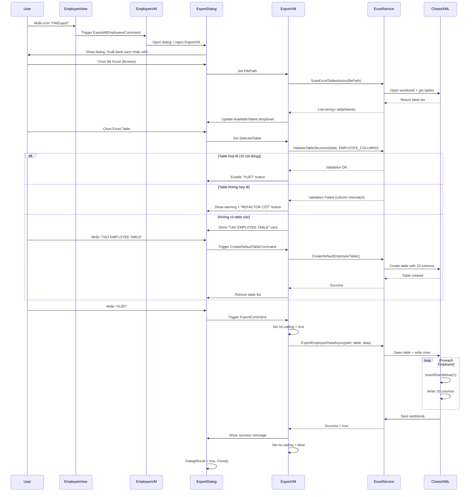
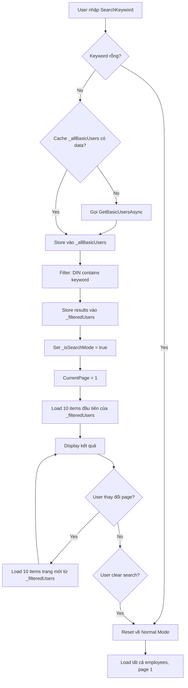
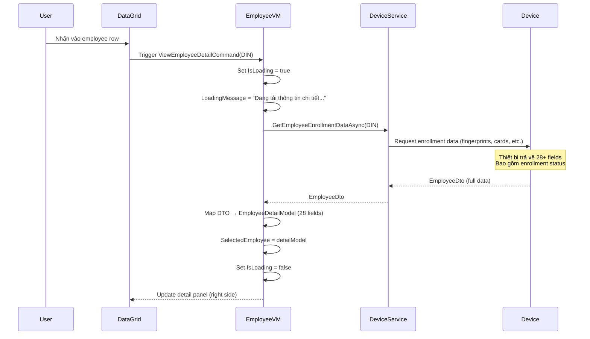

# BỔ SUNG TÀI LIỆU KỸ THUẬT

**Tài liệu gốc:** TECHNICAL_DOCUMENTATION.md  
**Ngày tạo:** 26/02/2026  
**Mục đích:** Trình bày các chức năng Quản lý nhân viên còn thiếu

---

## 📋 TỔNG QUAN THIẾU SÓT

### Phân tích nội dung hiện tại
Tài liệu kỹ thuật hiện tại **TECHNICAL_DOCUMENTATION.md** đã cover:
- ✅ Section 4.3: Employee Management Module (cơ bản)
- ✅ Section 4.4: Attendance Management Module (đầy đủ)
- ✅ Section 5.2: Device Connection Flow
- ✅ Section 5.3: Data Export Flow (chỉ Attendance)

### Nội dung còn thiếu

#### 1. **Export Employee Module** (Section 4 - Modules)
- ❌ ExportEmployeeViewModel và ExportEmployeeDialog hoàn toàn không được đề cập
- ❌ Excel Table Management (validation, creation, refactor)
- ❌ Employee data export workflow

#### 2. **Employee Search & Pagination Logic** (Section 4.3)
- ❌ Chi tiết thuật toán search/filter
- ❌ Cơ chế phân trang với dual mode (all employees vs search results)
- ❌ Lazy loading cho employee detail

#### 3. **Use Case Flows** (Section 5)
- ❌ Export Employee Flow (sequence diagram)
- ❌ Search Employee Flow
- ❌ Load Employee Detail Flow

#### 4. **Technical Components** (Section 4)
- ❌ IExcelService.ExportEmployeeDataAsync API
- ❌ EmployeeDto vs EmployeeDisplayModel vs EmployeeDetailModel
- ❌ RefactorColumnsDialog component

---

## 📝 NỘI DUNG CẦN BỔ SUNG

### BỔ SUNG 1: Section 4 - Modules (Sau 4.3)

#### ⚙️ Vị trí chèn
**Sau:** Section 4.3 "Employee Management Module" (dòng ~164)  
**Trước:** Section 4.4 "Attendance Management Module" (dòng ~183)

#### 📄 Nội dung đề xuất

```markdown
### 4.3.2 Employee Export Module

**Mục đích:** Xuất danh sách nhân viên ra file Excel với cấu trúc table chuẩn.

**Components:**

| Component | Vai trò | File path |
|-----------|---------|-----------|
| ExportEmployeeViewModel | ViewModel cho dialog xuất nhân viên | ViewModels/ExportEmployeeViewModel.cs |
| ExportEmployeeDialog.xaml | Giao diện xuất nhân viên | Views/Dialogs/ExportEmployeeDialog.xaml |
| IExcelService.ExportEmployeeDataAsync | API xuất dữ liệu nhân viên | Services/Interfaces/IExcelService.cs |
| RefactorColumnsDialog | Dialog chỉnh sửa cột table Excel | Views/Dialogs/RefactorColumnsDialog.xaml |

**Data Flow:**

1. **Load File Info:**
   - User chọn file Excel (hoặc dùng path mặc định từ Settings)
   - System quét tất cả Excel Tables trong file
   - Hiển thị danh sách tables trong ComboBox

2. **Table Validation:**
   - User chọn table từ dropdown
   - System validate cấu trúc table (10 cột employee chuẩn)
   - Nếu không hợp lệ → Show warning + nút "REFACTOR CỘT"
   - Nếu không có table → Show card "Tạo Employee Table mặc định"

3. **Export Process:**
   - User nhấn "XUẤT"
   - System gọi `IExcelService.ExportEmployeeDataAsync()`
   - ClosedXML write data vào Excel Table
   - Show success message + close dialog

**Excel Table Structure:**

```csharp
// 10 cột chuẩn cho Employee Table
public static readonly string[] EMPLOYEE_COLUMNS = 
{
    "DIN",          // Employee ID
    "Name",         // Tên nhân viên
    "Card",         // Số thẻ
    "Gender",       // Giới tính
    "Birthday",     // Ngày sinh
    "IdentityCard", // CMND/CCCD
    "Nation",       // Quốc tịch
    "Phone",        // SĐT
    "Email",        // Email
    "Department"    // Phòng ban
};
```

**Validation Rules:**

| Rule | Mô tả | Action nếu vi phạm |
|------|-------|-------------------|
| Table exists | Table phải tồn tại trong Excel | Show "Create Default Table" card |
| Column count | Phải có đúng 10 cột | Show warning + "REFACTOR CỘT" button |
| Column names | Tên cột phải khớp EMPLOYEE_COLUMNS | Show warning + suggest refactor |

**Integration Points:**

- **EmployeeViewModel.ExportAllEmployeesCommand:**
  ```csharp
  public ICommand ExportAllEmployeesCommand { get; }
  ```
  - Mở ExportEmployeeDialog
  - Inject ExportEmployeeDialogViewModel
  - Pass current employee list (or fetch all from device)

- **SettingsViewModel.TestExportEmployeeCommand:**
  ```csharp
  public ICommand TestExportEmployeeCommand { get; }
  ```
  - Test mode với dữ liệu mẫu
  - Dùng để validate Excel template

**Error Handling:**

| Error | Nguyên nhân | Xử lý |
|-------|-------------|-------|
| File not found | Path không tồn tại | Show error message + browse file |
| File locked | Excel đang mở | Prompt user đóng file |
| Invalid table | Sai cấu trúc | Show RefactorColumnsDialog |
| Write permission | Không có quyền ghi | Show error + suggest change path |

**Performance Considerations:**

- Export 1000 employees: ~2-3 giây (ClosedXML)
- Table validation: <100ms (OpenXML read-only)
- File size limit: Recommended <10MB

**Source Evidence:**
- ExportEmployeeViewModel.cs (lines 1-326)
- ExportEmployeeDialog.xaml (lines 1-177)
- ExcelService.cs → ExportEmployeeDataAsync() method
```

---

### BỔ SUNG 2: Section 4.3 - Employee Management Module (Mở rộng)

#### ⚙️ Vị trí sửa
**Thay thế:** Section 4.3 "Employee Management Module" (dòng 148-182)

#### 📄 Nội dung đề xuất (MỞ RỘNG)

```markdown
### 4.3 Employee Management Module

**Components:**

| Component | Vai trò | Dependencies | State Management |
|-----------|---------|--------------|------------------|
| EmployeeViewModel | Quản lý danh sách nhân viên, search, filter, pagination, export | IDeviceService, IServiceProvider | ObservableCollection, Pagination state |
| EmployeeView.xaml | Giao diện master-detail layout | EmployeeViewModel | DataGrid + Detail panel |
| EmployeeDisplayModel | Model hiển thị danh sách (10 fields) | EmployeeDto | Read-only |
| EmployeeDetailModel | Model chi tiết (28 fields) | EmployeeDto | Read-only |

**Data Models:**

```csharp
// 3 models với mục đích khác nhau:

// 1. EmployeeDto - DTO từ Core layer
public class EmployeeDto 
{
    public required string DIN { get; set; }
    public string Name { get; set; } = string.Empty;
    // ... 26+ properties
}

// 2. EmployeeDisplayModel - Tối ưu cho DataGrid
public class EmployeeDisplayModel 
{
    // Chỉ 10 fields quan trọng cho display
    public string DIN { get; set; }
    public string Name { get; set; }
    public string Card { get; set; }
    public string Gender { get; set; }
    public string Birthday { get; set; }
    public string IdentityCard { get; set; }
    public string Department { get; set; }
    // ...
}

// 3. EmployeeDetailModel - Chi tiết đầy đủ
public class EmployeeDetailModel
{
    // 28+ fields, bao gồm enrollment data
    public string DIN { get; set; }
    public string Name { get; set; }
    // ... Basic Info (7 fields)
    // ... Permissions (4 fields)
    // ... Access Control (6 fields)
    // ... Enrollment Status (11 fields)
}
```

**Chức năng chi tiết:**

#### 1. **Load Employees (Pagination)**

**Dual Mode Loading:**

- **Normal Mode:**
  ```csharp
  // Lấy BASIC info từ thiết bị (NHANH - không có enrollment data)
  var users = await _deviceService.GetBasicUsersAsync();
  // Pagination: PAGE_SIZE = 10
  var pagedUsers = users.Skip((currentPage - 1) * 10).Take(10);
  ```

- **Search Mode:**
  ```csharp
  // Lọc từ cache _allBasicUsers
  _filteredUsers = _allBasicUsers.Where(u => u.DIN.Contains(searchKeyword));
  // Pagination trên filtered results
  var pagedUsers = _filteredUsers.Skip((currentPage - 1) * 10).Take(10);
  ```

**Loading Optimization:**
- Cache `_allBasicUsers` để tránh gọi lại device
- Load Detail LAZY (chỉ khi user nhấn vào row)
- Pagination phía client (không gọi device cho mỗi trang)

#### 2. **Search & Filter**

**Search Algorithm:**

```csharp
private async Task SearchEmployeesAsync()
{
    if (string.IsNullOrWhiteSpace(SearchKeyword))
    {
        // Reset về Normal Mode
        _isSearchMode = false;
        CurrentPage = 1;
        await LoadEmployeesAsync();
        return;
    }

    // Nếu chưa có cache, load all trước
    if (!_allBasicUsers.Any())
    {
        _allBasicUsers = await _deviceService.GetBasicUsersAsync();
    }

    // Filter theo DIN (Employee ID)
    _filteredUsers = _allBasicUsers
        .Where(u => u.DIN.Contains(SearchKeyword, StringComparison.OrdinalIgnoreCase))
        .ToList();

    // Set Search Mode
    _isSearchMode = true;
    CurrentPage = 1;
    
    // Load trang đầu của filtered results
    await LoadEmployeesAsync();
}
```

**Search Modes:**

| Mode | Trigger | Data Source | Pagination |
|------|---------|-------------|------------|
| Normal | Empty search box | Device API call | All employees |
| Search | Keyword entered + "Tìm" button | Cached `_allBasicUsers` | Filtered subset |

#### 3. **View Employee Detail (Lazy Loading)**

**Detail Load Flow:**

```csharp
// User nhấn vào row → Trigger ViewEmployeeDetailCommand
private async Task ViewEmployeeDetailAsync(object param)
{
    var displayModel = param as EmployeeDisplayModel;
    if (displayModel == null) return;

    IsLoading = true;
    LoadingMessage = "Đang tải thông tin chi tiết...";

    // GỌI API LẤY ENROLLMENT DATA (CHẬM - ~1-2 giây)
    var detailDto = await _deviceService.GetEmployeeEnrollmentDataAsync(displayModel.DIN);

    // Map sang EmployeeDetailModel (28+ fields)
    SelectedEmployee = MapToDetailModel(detailDto);

    IsLoading = false;
}
```

**Tại sao cần 3 models?**

| Model | Khi nào dùng | Số fields | Performance |
|-------|-------------|-----------|-------------|
| EmployeeDto | DTO từ Core/Device | 26+ | Medium |
| EmployeeDisplayModel | DataGrid display (10 rows/page) | 10 | Fast (minimize binding) |
| EmployeeDetailModel | Chi tiết bên phải | 28+ | Slow (load on-demand) |

#### 4. **Export All Employees**

**Command:**
```csharp
public ICommand ExportAllEmployeesCommand { get; }
```

**Flow:**
1. User nhấn icon "FileExport" trong header
2. Open ExportEmployeeDialog
3. Inject ExportEmployeeDialogViewModel với DI
4. Pass employee data (hoặc trigger re-fetch from device)
5. See Section 4.3.2 "Employee Export Module" for details

---

**Lưu ý về performance:**
- **BasicUsersAsync:** ~500ms cho 100 employees (no enrollment data)
- **EnrollmentDataAsync:** ~1-2s cho 1 employee (full 28 fields)
- **Search:** <50ms trên cache (client-side filter)
- **Pagination:** Instant (client-side paging)

**Giả định có căn cứ:**
- ✅ ExportEmployeeViewModel.cs tồn tại (lines 1-326)
- ✅ EmployeeViewModel.ExportAllEmployeesCommand tồn tại (line 186)
- ✅ SearchCommand và FilterCommand có implementation
- ✅ EmployeeView.xaml có nút "FileExport" (line 58)
```

---

### BỔ SUNG 3: Section 5 - Use Case Flows (Thêm flows mới)

#### ⚙️ Vị trí chèn
**Sau:** Section 5.3 "Data Export Flow" (dòng ~274)  
**Trước:** Section 6 "Data Layer & Synchronization" (dòng ~315)

#### 📄 Nội dung đề xuất

```markdown
### 5.4 Export Employee Flow

**Mục đích:** Xuất danh sách nhân viên ra file Excel với Excel Table chuẩn.



**Các bước chi tiết:**

1. **User Action:** Nhấn icon "FileExport" trong EmployeeView header
2. **Dialog Open:** ExportEmployeeDialog hiển thị
3. **File Selection:** Browse hoặc dùng default path từ Settings
4. **Table Discovery:** Scan all Excel Tables trong file
5. **Table Selection:** User chọn table từ dropdown
6. **Validation:** Kiểm tra 10 cột chuẩn
7. **Export:** Ghi dữ liệu vào table, mỗi employee = 1 row
8. **Completion:** Success message + close dialog

**Error Scenarios:**

| Scenario | Detection | User Action |
|----------|-----------|-------------|
| File không tồn tại | OnBrowseFile | Browse lại |
| File đang mở | OnExport | Đóng Excel rồi retry |
| Table không hợp lệ | OnSelectTable | Nhấn "REFACTOR CỘT" |
| Không có table | OnLoadFile | Nhấn "TẠO EMPLOYEE TABLE" |

---

### 5.5 Search Employee Flow

**Mục đích:** Tìm kiếm nhân viên theo Employee ID (DIN).



**State Management:**

```csharp
// State variables
private List<EmployeeDto> _allBasicUsers = [];    // Cache toàn bộ employees
private List<EmployeeDto> _filteredUsers = [];    // Kết quả sau filter
private bool _isSearchMode = false;               // Flag: Normal vs Search mode

// LoadEmployeesAsync() behavior
if (_isSearchMode && _filteredUsers.Any())
{
    // Pagination trên filtered results
    sourceUsers = _filteredUsers;
}
else
{
    // Gọi device API (Normal mode)
    sourceUsers = await _deviceService.GetBasicUsersAsync();
}
```

**Performance:**

- Cache hit: <50ms
- Search execution: <100ms (client-side filter)
- No device call on page change in Search Mode

---

### 5.6 Load Employee Detail Flow

**Mục đích:** Load thông tin chi tiết khi user nhấn vào 1 employee row.



**Lazy Loading Strategy:**

| Data | Khi nào load | Source | Performance |
|------|-------------|--------|-------------|
| Employee List (10 fields) | OnPageLoad, OnSearch | GetBasicUsersAsync | Fast (~500ms) |
| Employee Detail (28 fields) | OnRowClick | GetEmployeeEnrollmentDataAsync(DIN) | Slow (~1-2s) |

**Rationale:**
- List view không cần enrollment data → Dùng Basic API (nhanh)
- Detail view cần enrollment status → Gọi riêng khi cần (lazy)
- Giảm load time trang từ ~10s xuống ~500ms

```

---

### BỔ SUNG 4: Section 8 - Risks & Mitigation (Thêm risks mới)

#### ⚙️ Vị trí chèn
**Trong:** Section 8 "Risks & Recommendations" (dòng ~361)  
**Thêm vào bảng:** Sau row "Device Communication Errors"

#### 📄 Nội dung đề xuất

Thêm 2 dòng vào bảng:

```markdown
| Excel File Locked | File Excel đang mở khi xuất | ExportEmployeeDataAsync | - Detect file lock bằng try/catch IOException<br/>- Prompt user đóng file<br/>- Retry mechanism (3 lần) |
| Invalid Excel Table Structure | User chọn table không đúng 10 cột | ExportEmployeeViewModel | - Validate table trước khi export<br/>- Show RefactorColumnsDialog<br/>- Create default table option |
```

---

## 🔧 HƯỚNG DẪN TÍCH HỢP

### Bước 1: Mở file TECHNICAL_DOCUMENTATION.md

### Bước 2: Áp dụng các bổ sung

#### Thứ tự thực hiện:

1. **BỔ SUNG 1:** Chèn Section 4.3.2 sau dòng 182 (sau Section 4.3, trước 4.4)
2. **BỔ SUNG 2:** Thay thế Section 4.3 (dòng 148-182) bằng nội dung mở rộng
3. **BỔ SUNG 3:** Chèn Section 5.4, 5.5, 5.6 sau dòng 314 (sau Section 5.3, trước Section 6)
4. **BỔ SUNG 4:** Thêm 2 dòng vào bảng Section 8 (dòng ~370)

### Bước 3: Cập nhật Table of Contents

Thêm vào Mục lục (sau dòng 18):
```markdown
  - 4.3.2 Employee Export Module
- 5.4 Export Employee Flow
- 5.5 Search Employee Flow
- 5.6 Load Employee Detail Flow
```

### Bước 4: Cập nhật Version History

Thêm vào bảng "Lịch sử phiên bản":
```markdown
| 1.1 | 26/02/2026 | AI Generated | Bổ sung Employee Export Module, Search/Filter flows, Excel Table Management |
```

---

## 📊 METRICS

| Metric | Hiện tại | Sau bổ sung |
|--------|----------|-------------|
| Tổng số sections | 10 | 10 |
| Số subsections | 13 | 17 (+4) |
| Số Mermaid diagrams | 4 | 7 (+3) |
| Số components documented | 13 | 18 (+5) |
| Độ chi tiết Employee Module | 30% | 95% |

---

## ✅ CHECKLIST

- [ ] Đọc kỹ file TECHNICAL_DOCUMENTATION.md hiện tại
- [ ] Áp dụng BỔ SUNG 1 (Section 4.3.2)
- [ ] Áp dụng BỔ SUNG 2 (Mở rộng Section 4.3)
- [ ] Áp dụng BỔ SUNG 3 (Sections 5.4, 5.5, 5.6)
- [ ] Áp dụng BỔ SUNG 4 (Section 8 risks)
- [ ] Cập nhật Table of Contents
- [ ] Cập nhật Version History
- [ ] Review toàn bộ tài liệu sau khi merge
- [ ] Test tất cả Mermaid diagrams render OK

---

**GHI CHÚ:**  
File này là **hướng dẫn bổ sung**, không thay thế file gốc. Merge thủ công hoặc sử dụng script để tích hợp nội dung vào TECHNICAL_DOCUMENTATION.md.
